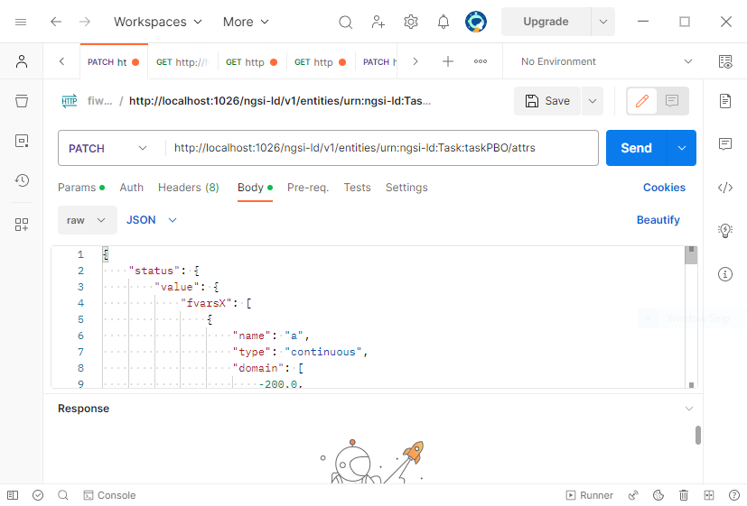
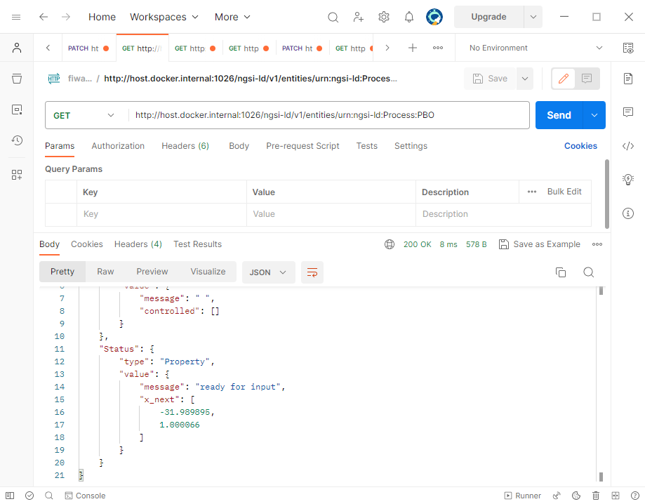

# Fiware
```console
cd FIWARE
docker-compose up -d
```

Test connection going into   [localhost:1026/version](http://localhost:1026/version)

```console
python createEntities.py
python createSubscriptions.py
```
These two scripts must returns code 201.

# PBO 

```console
cd ..
docker-compose build --no-cache
docker-compose up
```

## Testing the connection to PBO
### Browser side
Test connection going into   [http://localhost:5000/try](http://localhost:5000/try), the service will return the message "it works".
### Postman side
It is possible testing the connection also with [postman](https://www.postman.com/downloads/ ):
- Method: get
- URL: http://localhost:5000/try


## Testing the optimization
To test the optimization you need the following elements.

### 1. fvarsX: variables to be optimized.
PBO needs information about the variable to be optimized, its type(discrete or continuous) and its domain.
```console
"fvarsX": [
        {
            "name": "a",
            "type": "continuous",
            "domain": [
                -200.0,
                200.0
            ]
        },{
            "name": "b",
            "type": "discrete",
            "domain": [
                -200.0,
                200.0,
                1
            ]
        }
    ],
```
In the case above, we want to optimize 2 variables, the first is named "a", it is a continuous variable and it can assume values between -200 and 200;
the second variable is named "b" and it is discrete, it can assume values between -200 and 200 with step of 1;

### 2. fvarsY: model used
This field must always be specified in this way. At the moment it is not used, but it was decided to include it for possible future implementations in which more than one evaluation criterion could be specified.
```console
    "fvarsY": [
        {
            "name": "out1",
            "type": "continuous",
            "domain": []
        }
    ]
```
### 3. acquisition_optimizer_type: the type of acquisition function.
```console
 "acquisition_optimizer_type": "lbfgsb"
```
### 4. x: the points already tested
PBO needs as input the initial points that are already tested.
```console
    "x": [
        [
            -10,1
        ],
        [
            44,1
        ],
        ...,
        [
            -16,1
        ]
    ]
```
Since the variable to be optimized are 2, every field of this array contains 2 elements.
### 5. b_in: the initial comparison
PBO needs as input the initial comparisons.
```console
 "b_in": [
        [
            0,
            1,
            1
        ],
        [
            2,
            1,
            1
        ],
        ...,
        [
            10,
            12,
            1
        ]
    ],
```
In the above example, the first array states that point at the position 0 of "x" array is better than the point at the position 1 of the same array, to sum up:
x[0] is better than x[1], x[2] is better than x[1], x[10] is better than x[12], 

### 5. b_best:  the best point seen so far
PBO needs as input the best point seen so far.
```console
"b_best": [
    10
]
```
In this case the best point seen so far is the point at the position 10 of "x" array, in other words the best point is x[10].


### 6. delta: exploration parameter
This parameter can assume value between 0 and 10. The higher this value is, the more PBO will explore.
```console
"delta": 3
```

### 7. the entire task to post
Make a patch call with postman:
- Method: path
- URL: http://localhost:1026/ngsi-ld/v1/entities/urn:ngsi-ld:Task:taskPBO/attrs
Body - Raw - Json:

```console
{
    "status": {
        "value": {
            "fvarsX": [
                {
                    "name": "t1",
                    "type": "continuous",
                    "domain": [
                        -20000.0,
                        200.0
                    ]
                },
                {
                    "name": "ciao2",
                    "type": "continuous",
                    "domain": [
                        -200.0,
                        200.0
                    ]
                }
            ],
            "fvarsY": [
                {
                    "name": "out1",
                    "type": "continuous",
                    "domain": []
                }
            ],
            "acquisition_optimizer_type": "lbfgsb",
            "x": [
                [
                    -10,
                    1
                ],
                [
                    44,
                    1
                ],
                [
                    -16,
                    1
                ],
                [
                    -4,
                    1
                ],
                [
                    10,
                    1
                ],
                [
                    -160,
                    1
                ],
                [
                    60,
                    1
                ],
                [
                    2,
                    1
                ],
                [
                    -2.34,
                    1
                ],
                [
                    2.75,
                    1
                ],
                [
                    0.20,
                    1
                ],
                [
                    2.27,
                    1
                ],
                [
                    0.2039585,
                    1
                ]
            ],
            "b_in": [
                [
                    0,
                    1,
                    1
                ],
                [
                    2,
                    1,
                    1
                ],
                [
                    3,
                    2,
                    1
                ],
                [
                    3,
                    4,
                    1
                ],
                [
                    3,
                    5,
                    1
                ],
                [
                    3,
                    6,
                    1
                ],
                [
                    7,
                    6,
                    1
                ],
                [
                    7,
                    8,
                    1
                ],
                [
                    7,
                    9,
                    1
                ],
                [
                    10,
                    7,
                    1
                ],
                [
                    10,
                    11,
                    1
                ],
                [
                    10,
                    12,
                    1
                ]
            ],
            "b_best": [
                1
            ],
            "boolean_test": "True",
            "exploration": "True",
            "delta": 34
        }
    }
}
```




### 8. Get the result
Make a get call with post man:
- Method: get
- URL: http://host.docker.internal:1026/ngsi-ld/v1/entities/urn:ngsi-ld:Process:PBO

The result of the task is stored in "Status"."Value"."x_next"



### 9. Example of interaction with code
[example_rest](example_rest.py) shows an example of interaction between user and PBO.
To do that, a hidden function is simulated :`f(x,y) = x_1^2+x_2^2`, defined in `R^2 \in {-200,200; -200,200 }`. This function has the optimum point in `x_opt = [0,0]`.
To start the optmization, initial points and their comparison are needed, in this case:
`x_0  = 34,32. f(x_0) = 2180.
x_1  = 12,65. f(x_1) = 4369.
x_2  = 8, 43. f(x_2) = 1913.
x_3  = 12,12. f(x_3) = 288.
x_4  = 42,24. f(x_4) = 2340.
x_5  = 18,30. f(x_5) = 1224.
`
From this point, it is possible to say that 
- x_0 is better than x_1 , because `f(x_0) < f(x_1)`.
- x_2 is better than x_1 , because `f(x_2) < f(x_1)`.
- x_3 is better than x_2 , because `f(x_3) < f(x_2)`.
- x_3 is better than x_4 , because `f(x_3) < f(x_4)`.
- x_3 is better than x_5 , because `f(x_3) < f(x_5)`.

It is possible also expressing the best point seen so far: x_3.

All these information will be sent to the taskPBO using the json file in [ut](ut.py) from line 75.


